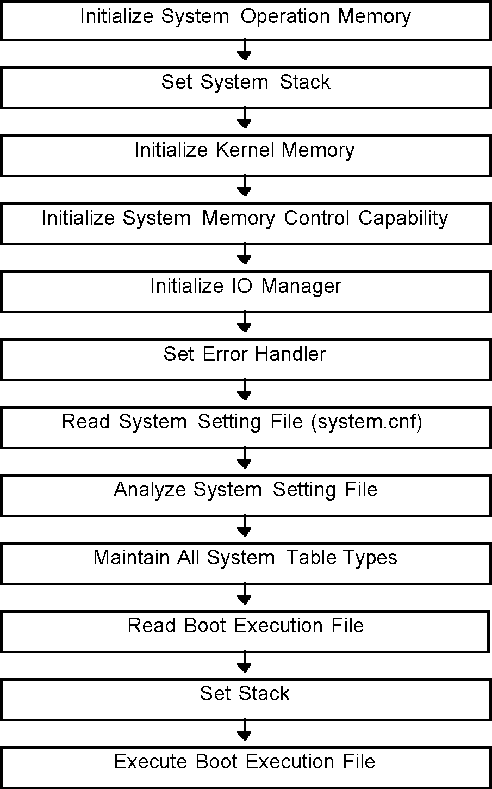
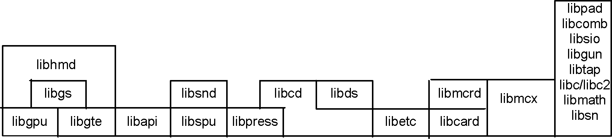

# The PlayStation OS

The PlayStation OS is a flexible and powerful operating system, which allows developers to take maximum advantage of the PlayStation’s capabilities.

The OS has been developed for the R3000, which is the PlayStation's CPU. The efficiency of program development relies heavily on the environment and services provided by the OS. If the CPU and peripheral devices are fast enough, you won’t need to spend your time trying to maximize the hardware’s capabilities. You can concentrate on programming using the services the OS provides for you.

The PlayStation OS is designed to give the game program developer an environment in which interrupts can be easily controlled. Based on this concept, the kernel of the PlayStation OS provides services to control PlayStation hardware and the R3000.

Each service is provided as a C language function. By using C, your programs can be more readable and maintainable, and you can program more easily using block structure description and function calls.

# Features of the PlayStation OS

This section describes the characteristics of the PlayStation’s design concept.

# Programming in C

Most services, such as controlling the R3000 CPU and the PlayStation hardware, are provided as C language functions. Therefore, programs can be written completely in C.

Easy Access to the Features of the R3000
Interrupt control in the R3000 is said to be complicated, but the PlayStation OS uses a substitute “dispatcher” system which has a simple interface. The dispatcher’s overhead is kept very low, and it provides low-level support not available in ordinary operating systems. Because of this, the chip's capabilities can be fully exploited and high quality tuning can be achieved. And because everything can be done in C, it is not necessary to learn the intricacies of R3000 assembler.

# Small Size, Emphasis on Performance

Because of the importance of an application's performance, the PlayStation OS was designed so that its RAM usage (64K bytes) and use of the CPU are kept to a minimum. In addition, the OS system tables are disclosed, and consideration given to future expansion of the OS.

To achieve greater speed, the PlayStation OS doesn’t carry out many checks of prohibited items that other operating systems would. This policy allows applications to achieve a higher level of tuning. However, to avoid the risk of prohibited operations being performed, applications may need to perform some checks that would normally be carried out by the operating system.

# Provision for Hardware Functions

Previously, to control video game machine hardware, one has had to analyze hardware driver code and painstakingly write one’s code in assembler. The PlayStation OS lightens this burden by providing C language functions to control hardware. The overhead of each function is kept to a minimum.

# Single and Multitasking

The PlayStation OS can carry out many tasks asynchronously while executing code, such as controlling a CD-ROM drive, which is a comparatively slow device, and playing background music.

When the OS starts, it is in single-task mode. If desired, you can specify that your application will have multiple tasks or threads. See Chapter 2, “Kernel Library”, for information on threads.

# The File System Device Driver

The PlayStation’s file system (i.e., files of data on CD-ROM) is accessed via a device driver. This allows multiple file systems to coexist, and improves development time by avoiding low level file manipulation problems.

# Starting and Operating the OS

The PlayStation OS provides a game program developer's environment. Therefore, there is fundamentally no interface for the user to operate directly (excluding the debug monitor in the debug environment).

Applications must provide the user interface.

# Activation of the OS

When the system starts, it jumps first a special address in ROM and performs a check on connected hardware (such as a CD-ROM drive).

It then checks for a suitable disk in the CD-ROM drive. If it finds one, it reads the system configuration file (*SYSTEM.CNF*).
If there is no disk, a ROM-resident demonstration program plays repeatedly.

# Boot Sequence

The boot sequence is as follows:

Figure 1-1: Boot Sequence
 
 
 # PlayStation OS Library Components

PlayStation libraries can be thought of as low-level libraries or high-level libraries, depending on their relationship to the PlayStation OS. They form a two-level library structure. Programs may use any level as needed, and, with some exceptions, may use both levels concurrently.

Figure 1-2: PlayStation library structure
 

A summary of the libraries follows:

** libapi (Kernel Library)**

Provides an interface (API) between the PlayStation OS and applications.

**libc/libc2 (Standard C Libraries)**

A subset of the standard C library, including character functions, memory operation functions, character class tests, non-local jumps, and utility functions.

**libmath (Math Library)**

Contains ANSI/IEEE754 compliant math functions and a software floating point computation package.

**libcard (Memory Card Library)**

Provides functions for controlling the Memory Card, which preserves data after reset and power off. It includes the Memory Card, the file system, and drivers.

**libmcrd (Extended Memory Card Library)**

Provides a high-level interface to the Memory Card.

**libpress (Data Compression Library)**

Provides functions for compressing (encoding) and expanding (decoding) image and sound data.

**libgpu (Basic Graphics Library)**

Contains commands for the drawing engine and for building a drawing command list. Handles data for simple entities such as sprites, polygons and lines.

**libgte (Basic Geometry Library)**

A library for controlling the GTE (geometry transformation engine). Handles data such as matrices and vertices.

**libgs (Extended Graphics Library)**

A three-dimensional graphics system which uses libgpu and libgte. Handles larger entities such as objects and background surfaces.

**libcd (CD/Streaming Library)**

Reads program, image, and sound data from a CD-ROM drive, and performs playback of DA (digital audio) and XA sound. Also includes fast disk access through a file name key, and a support function for simultaneous data reading and processing streaming techniques.

**libds (Extended CD-ROM Library)**

Builds a new interface to the CD-ROM library kernel. Has the same capabilities as libcd and places further emphasis on reliable CD-ROM controls such as performing error recovery .
