# Базовая графическая библиотека

# Обзор

Библиотека базовой графики (libgpu) — это библиотека функций низкого уровня, позволяющая работать с примитивами, такими как треугольники, прямоугольники и спрайты. Это обеспечивает:

- **Системные функции** для управления всей графической системой (например, сброс графической системы).
- **Функции доступа к буферу** кадров для непосредственного чтения и записи содержимого буфера кадров.
- **Примитивные функции** для инициализации и управления примитивными структурами и установки страницы текстуры.
- **Функции таблицы заказа** для записи примитивов в таблицу заказа, управления таблицами заказа и рисования примитивов таблицы заказа.
- **Функции синхронизации** для синхронизации вашего кода с аппаратными событиями, такими как период вертикального пробела и завершение операций рисования.

#  Библиотека и заголовочные файлы

Чтобы использовать службы графической библиотеки, необходимо установить связь с файлом libgpu.lib. Вы также должны связать libapi.lib и libetc.lib при использовании libgpu.lib.

Ваши исходные файлы должны включать заголовочный файл libgpu.h. Кроме того, необходимо включить libgte.h и sys/types.h. Вы включаете sys/types.h, поскольку он определяет следующие типы данных, используемые libgpu.h:

```c
typedef unsigned char  u_char;   
typedef unsigned short u_short;
typedef unsigned int   u_int;
typedef unsigned long  u_long;
```

# Графическая система

Графическая система PlayStation состоит из:

Специализированный высокоскоростной механизм рендеринга графики, известный как GPU (Graphics Processing Unit).

Область высокоскоростной видеопамяти объемом 1 МБ, называемая буфером кадра. Он используется для хранения графических данных, включая информацию, используемую для текущего отображения видео, области рисования, а также текстур и таблиц цветов.

Сопроцессор (GTE) для выполнения высокоскоростных геометрических операций. Графический процессор может использовать результаты расчетов GTE в своих командах. GTE обсуждается в главе 9 (Библиотека базовой геометрии).

**Рисунок 8-1: Графическая система**
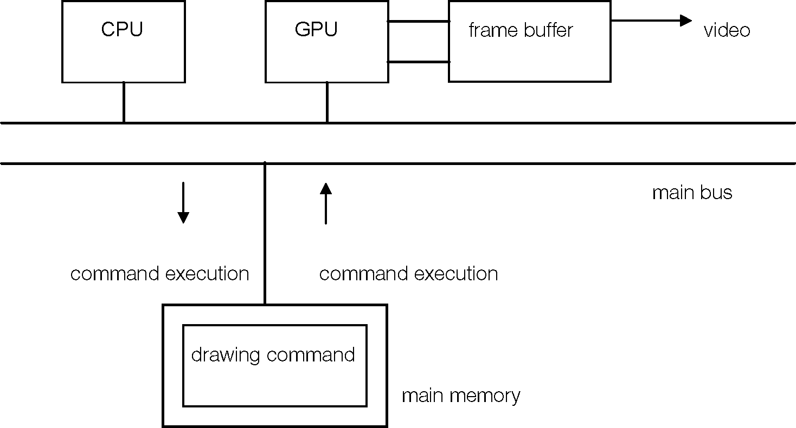


Графический процессор рисует графику в области рисования кадрового буфера, выполняя строки инструкций (примитивы), хранящиеся в основной памяти. Структуры данных Libgpu близко соответствуют примитивам, распознаваемым самим аппаратным обеспечением графического процессора.

Данные из буфера кадров постоянно используются для создания видеосигнала, отображаемого на мониторе вашего телевизора. Путем перезаписи содержимого кадрового буфера со скоростью до 60 раз в секунду создаются движущиеся изображения. Примечание. Графическая система не содержит специальной фоновой плоскости для отображения данных изображения после того, как оно временно отрисовано в буфере кадра.

# Адресация кадрового буфера

Буфер кадра организован в виде растрового изображения шириной 1024 пикселя и высотой 512 пикселей, по 16 бит на пиксель.

Таким образом, общий размер буфера кадра составляет один мегабайт (1024 x 512 пикселей x 2 байта на пиксель). Он используется для хранения шаблонов текстур и таблиц поиска цветов (CLUT), а также содержит области рисования и отображения.

**Рисунок 8-2: Буфер кадров**
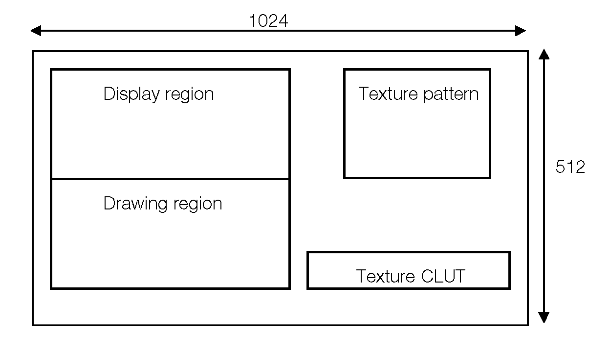

Пиксели в буфере кадра задаются двумерными координатами. Координаты X варьируются от 0 до 1023, а координаты Y — от 0 до 511. Каждый пиксель имеет 16-битную глубину: 5 бит для синего, 5 бит для зеленого и 5 бит для красного; старший бит указывает состояние полупрозрачного режима, как показано ниже:


**Рисунок 8-3: Пиксели**
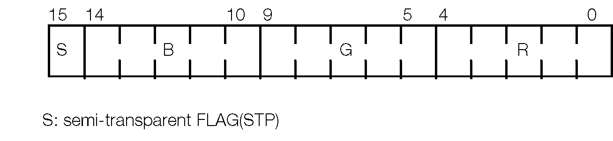

# Область отображения и область рисования

Область отображения представляет собой прямоугольную часть буфера кадров, используемую для отображения видеоизображения. Его размер зависит от режима отображения и варьируется от 256 x 240 до 640 x 480 (709 x 488 при пересканировании).

Можно выбрать любую из следующих комбинаций:


**Таблица 8-1: Режимы отображения**

|Параметр|Значение|
|Ширина|256, 320, 360, 512, 640|
|Высота|240 (чересстрочная развертка выключена), 480 (интерлейсная развертка включена)|
|Пиксельный режим|24-битный, 16-битный|
|Чересстрочная развертка|Вкл., выкл. (должно быть выключено в режиме 480 строк)|

**Примечание**. Высота экрана рассчитана для системы NTSC. Информацию о работе с PAL см. в разделе «Работа с форматом PAL».

Область рисования представляет собой прямоугольную часть буфера кадра, в которую отрисовываются графические данные. Его размер не ограничен, пока он полностью содержится в буфере кадра.

Если какая-либо часть области рисования перекрывает область отображения, ее данные отображаются на экране. Чтобы избежать этого эффекта, обычно используется схема двойной буферизации. Вы подготавливаете две отдельные области одинакового размера в буфере кадра. Одна область используется для рисования, а другая отображается. После завершения рисования в области рисования вы переключаете области. Обычно переключение выполняется во время вертикального отсутствия изображения, чтобы избежать неприглядного мерцания или разрывов экрана.

# Среда рисования

Среда рисования содержит общую информацию, относящуюся к рисованию двумерных примитивов, такую как положение области рисования и смещение рисования. Эта информация хранится в структуре DRAWENV, определенной следующим образом:

```c
typedef struct DRAWENV {
					RECT clip;*clipping (drawing) area*/


    

					short ofs[2];                        /*drawing offset*/
					RECT tw;                             /*texture window*/
					unsigned short tpage;                /*texture page*/
					unsigned char dtd;                   /*dither flag (0:off, 1:on)*/
					unsigned char dfe;                   /*display area drawing flag*/
					unsigned char isbg;                  /*enable to auto-clear)*/
					unsigned char r0, g0, b0;            /*initial background color*/
					DR_ENV dr_env;                       /*reserved*/
}DRAWENV;

```

Вы можете использовать функцию SetDefDrawEnv() для установки полей структуры DRAWENV. Вы используете PutDrawEnv(), чтобы сделать его текущей средой рисования. Чтобы получить указатель на текущую среду рисования, вызовите GetDrawEnv().

DRAWENV содержит следующую информацию:
- **Обрезка**: область рисования (обрезки) представляет собой прямоугольную область в буфере кадра, определяемую (clip.x, clip.y) -(clip.x + clip.w, clip.y + clip.h).
- **Смещение**: смещения ofs[0] и ofs[1] добавляются к значениям X и Y соответственно всех примитивов перед рисованием.
- **Окно текстуры**: (tw.x, tw.y) — (tw.x + tw.w, tw.y + tw.h) определяет прямоугольник внутри страницы текстуры, который будет использоваться для рисования текстур.
- **Страница текстуры**: tpage указывает страницу текстуры, которая будет использоваться в качестве шаблона текстуры по умолчанию. Одна страница текстуры имеет размер 256 х 256 пикселей.
- **Флаг обработки сглаживания**: если dtd установлен в 1, механизм рисования выполняет сглаживание при рисовании пикселей.
- **Флаг рисования области отображения**: если dfe равен 1, рисование в области отображения разрешено. (По умолчанию рисование в области отображения заблокировано.)
- **Флаг очистки области рисования**: если для isbg установлено значение 1, область отсечения очищается до цвета RGB, заданного полями r0, g0 и b0, когда установлена ​​среда рисования.
- **Цвет фона**: r0, g0, b0 — значения цвета RGB, используемые для очистки области обрезки, когда для поля isbg установлено значение 1.

# Отображение среды

Информация, относящаяся к отображению буфера кадров, такая как положение области отображения, называется средой отображения. Информация о среде отображения хранится в структуре DISPENV, определенной следующим образом:

```c
typedef struct DISPENV{
			RECT disp;                    /*display area*/
			RECT screen;                  /*display start point*/
			unsigned char isinter;        /*interlace 0: off 1: on*/
			unsigned char isrgb24;        /*RGB 24-bit mode */
			unsigned short pad0, pad1;    /*reserved */
}DISPENV;

```
Вы можете использовать SetDefDispEnv() для установки полей структуры DISPENV. Чтобы сделать его текущей средой отображения, вызовите PutDispEnv(). Чтобы получить указатель на текущую среду отображения, вызовите GetDispEnv().

DISPENV содержит следующую информацию:

- **Область отображения**: прямоугольная область внутри буфера кадра (disp.x, disp.y) – (disp.x + disp.w, disp.y + disp.h) является областью отображения. Его ширина (disp.w) может составлять 256, 320, 360, 512 или 640 пикселей. Его высота (disp.h) может составлять 240 или 480 пикселей.
- **Область экрана** (screen.x, screen.y, screen.w, screen.h): определяет, где на реальном физическом экране отображается область отображения. Стандартные координаты экрана монитора: (0, 0) – (256, 240). Если вы укажете меньшую область экрана, это будет нижнее сканирование; если вы укажете большую площадь экрана, это будет переразвертка. Например, если для screen.w установлено значение больше 256, больше пикселей, чем 256, невозможно отобразить, даже в режиме 320. Размер каждого пикселя не меняется.
- **Чересстрочная развертка**: если для параметра isinter установлено значение 1, отображение будет в чересстрочном режиме. (Если высота равна 480, отображение находится в чересстрочном режиме независимо от установки этого флага.)
- **Флаг 24-битного режима**: если для isrgb24 установлено значение 1, данные кадрового буфера интерпретируются как 24-битные пиксельные форматы вместо стандартного 16-битного.

# Область отображения и область экрана

На следующем рисунке показано соотношение между областью отображения и областью экрана:

**Рисунок 8-4: Область отображения и область экрана**

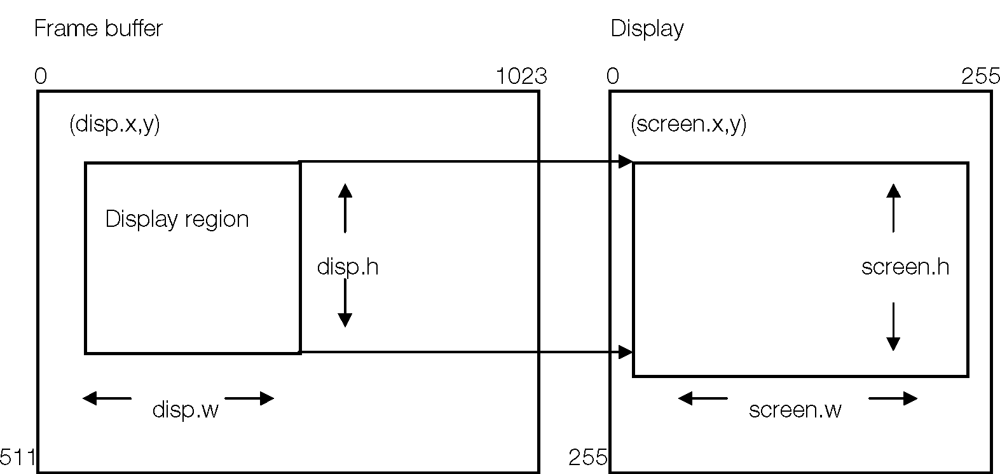

# Переключение сред отображения и рисования (двойной буфер)

Система двойной буферизации использует две области в буфере кадра, которые переключаются между средами отображения и рисования. Например, когда буфер 0 занимает прямоугольную область (0,0)–(320 240) в кадровом буфере, а буфер 1 находится в диапазоне (0,240)–(320 480), соответствующие среды рисования и отображения устанавливаются следующим образом:

**Таблица 8-2: Двойной буфер**

| |Буфер 0|Буфер 1|Примечания|
|----|------|------|---------|
|Среда рисования (clip.x, clip.y)|(0,0)| |(0, 240)|
|Начальная точка клипа (ofs[0], ofs[1])|(0,0)|(0, 240)|Смещение рисунка|
|Среда отображения(disp.x, disp.y)|(0,0)|(0, 240)|Начало области отображения|

Поля структур DRAWENV и DISPENV можно задать с помощью функций SetDefDrawEnv() и SetDefDispEnv(). Чтобы переключить буферы рисования и отображения, используйте PutDrawEnv() и PutDispEnv(), чтобы установить новые среды рисования и отображения.

Если вы измените среду рисования с помощью PutDrawEnv() во время рисования, это не повлияет на текущий выполняемый примитив или на остальную часть текущего списка примитивов. Новая среда рисования вступит в силу при следующей операции рисования.

Помимо использования PutDrawEnv(), вы также можете динамически переключать всю среду рисования или ее часть в середине рисования, зарегистрировав специальный примитив в таблице упорядочения. Дополнительные сведения см. в разделах «Примитивы» и «Таблицы заказа».

С другой стороны, настройки, выполненные в среде отображения, вступают в силу немедленно. Следовательно, местоположение отображения и область отображения можно изменить, даже когда рисование выполняется в фоновом режиме.


Следующий код показывает базовый метод переключения двойных буферов:

```c
		DRAWENV drawenv[2];	/*drawing	environments*/
		DISPENV dispenv[2];	/*display	environments*/
		int dispid = 0;	/*display	buffer ID*/
		
		while (1) { 
			VSync(0);	/*wait for vertical blank*/
			dispid = (dispid + 1) %2;	/*toggle buffer ID between 0 and 1*/
			PutDrawEnv(&drawenv[dispid]);	/*switch drawing environment*/
			PutDispEnv(&dispenv[dispid]);	/*switch display environment*/
}
```
Если вы используете чересстрочный режим с высотой 480 строк, установка двойного буфера может быть невозможна или нецелесообразна. (Например, в режиме 640 x 480 в кадровом буфере нет места для двух буферов.) Таким образом, один буфер можно использовать как для рисования, так и для отображения.

В чересстрочном режиме в каждом кадре (1/60 секунды) дисплей поочередно обновляет либо нечетные, либо четные строки буфера. Фактически, нечетные строки повторно отображаются каждые 1/30 секунды, и то же самое касается четных строк.

Если вы установите флаг dfe вашей структуры DRAWENV на ноль, рисование в областях экрана, отображаемых в данный момент, будет запрещено. Это позволяет рисовать только нечетные линии, когда отображаются четные линии, и четные линии, когда отображаются нечетные линии. Это эквивалент обычного переключения с двойным буфером. Вам не нужно выполнять какое-либо явное переключение между средами отображения и рисования.

**Примечание**. Чтобы эта схема была эффективной, рисование должно завершиться в течение 1/60 секунды.

# Блокирующие и неблокирующие функции

Функции, которые завершают свою обработку перед возвратом, называются блокирующими функциями. То есть программа блокируется и следующая инструкция не может быть выполнена до тех пор, пока не завершится текущая.

Некоторые функции рисования, которые обычно занимают много времени, обрабатываются в фоновом режиме и возвращаются, не дожидаясь завершения. Это так называемые неблокирующие функции.

Следующие функции, которые напрямую обращаются к содержимому кадрового буфера, являются неблокирующими:

- LoadImage() — передача из основной памяти в кадровый буфер.
- StoreImage() — передача из буфера кадра в основную память.
- MoveImage() — перенос из кадрового буфера в кадровый буфер.

Следующие функции, рисующие примитивы, также неблокируются. Дополнительную информацию смотрите в разделах «Примитивы» и «Таблицы заказа».

- DrawPrim() — рисование примитива.
- DrawOTag() — выполнить список примитивов графического процессора.

Все функции, кроме перечисленных выше, являются блокирующими.

Чтобы определить, завершились ли неблокирующие функции, или дождаться их завершения, вы можете вызвать DrawSync(). Например:

```c
LoadImage(&rect, pix); /*A non-blocking function*/
DrawSync(0);	/*Waits for drawing to complete*/

```
Дополнительную информацию о DrawSync() см. в разделе «Синхронизация».
В очередь можно поставить максимум 64 неблокирующие функции. 

**Например:**

```c
DrawOTag(ot0);	/*0*/
DrawOTag(ot1);	/*1*/
DrawOTag(ot2);	/*2*/
```
Если DrawOTag(ot0) не завершается при вызове DrawOTag(ot1), система просто регистрирует запрос в очереди и завершает работу. DrawOTag(ot1) ждет, пока DrawOTag(ot0) завершится, а затем выполняется автоматически.

Очередь содержит максимум 64 элемента, поэтому, если в очередь попадает 65-й запрос, он блокируется до тех пор, пока очередь не откроется.

```c
for (i = 0; i<100; i++) 
	LoadImage(......);

```

В этом примере 65-й LoadImage блокируется до тех пор, пока не будет завершен первый LoadImage и не станет доступна очередь ожидания.

# Примитивы

Наименьшая команда, которую может обработать графическая система, называется примитивом (или пакетом). Примитивы — это структуры данных, которые создаются и хранятся в основной памяти, и ЦП, и графический процессор могут обращаться к ним одновременно.
Примитивы классифицируются как один из следующих:

- Примитивы рисования фактически рисуют пиксели в буфере кадра.
- Специальные примитивы изменяют определенные параметры графического процессора, такие как область обрезки и страница текстуры, во время рисования. Они не меняют напрямую содержимое буфера кадра.

# Рисование примитивов

Примитивы рисования перечислены ниже. Существует четыре различных типа примитивов рисования: многоугольник, линия, спрайт и плитка.

## Многоугольные примитивы

При рисовании полигонов вы можете выбрать:
- Количество сторон (3 или 4)
- Штриховка (Гуро или плоская)
- Наложение текстур (вкл. или выкл.)
Поэтому можно использовать следующие полигональные примитивы:

**Таблица 8-3: Полигональные примитивы**

|Примитивное имя|Содержание|
|---------------|----------|
|POLY_F3|Трехсторонний многоугольник (треугольник), плоская заштрихованность|
|POLY_FT3|Трехсторонний многоугольник (треугольник), плоская заливка, текстура|
|POLY_G3|Трехсторонний многоугольник (треугольник), заштрихованный по Гуро|
|POLY_GT3|Трехсторонний многоугольник (треугольник), заштрихованный по Гуро, текстурированный|
|POLY_F4|4-сторонний многоугольник (квадрат), плоская заштрихованность
|POLY_FT4|4-сторонний многоугольник (квадрат), плоская затененная текстура
|POLY_G4|4-сторонний многоугольник (квадрат), заштрихованный по Гуро
|POLY_GT4|4-сторонний многоугольник (квадрат), заштрихованный по Гуро, текстурированный

## Линейные примитивы

Линейные примитивы рисуют прямые линии.

**Таблица 8-4: Линейные примитивы**

|Примитивное имя|Содержание|
|---------------|----------|
|LINE_F2|Прямая линия между двумя точками|
|LINE_G2|То же, что LINE_F2, но с градацией цвета.|
|LINE_F3|Две соединенные линии, идущие из точек A в B, затем из B в C.|
|LINE_G3|То же, что LINE_F3, но с градацией цвета.|
|LINE_F4|Три соединенные линии, идущие из точек A в B, B в C и C в D.|
|LINE_G4|То же, что LINE_F4, но с градацией цвета.|


# Спрайты и плиточные примитивы

Эти примитивы используются для рисования прямоугольных областей. Плитки рисуются сплошным цветом, а спрайты накладываются на текстуры.


**Таблица 8-5: Примитивы спрайтов**

|Примитивное имя|Содержание|
|------------|-------------|
|SPRT|Спрайт с текстурой (любом размере)|
|SPRT_8|Спрайт с текстурой (фиксированный размер 8 x 8 пикселей)|
|SPRT_16|Спрайт с текстурой (фиксированный размер 16 x 16 пикселей)|
|TILE|Нетекстурированная однотонная плитка (любой размер)|
|TILE_1|Нетекстурированная однотонная плитка (фиксированный размер 1 на 1 пиксель, т.е. одна точка)|
|TILE_8|Нетекстурированная сплошная цветная плитка (фиксированный размер 8 x 8 пикселей)|
|TILE_16|Нетекстурированная сплошная цветная плитка (фиксированный размер 16 x 16 пикселей)|


# Специальные примитивы

Специальные примитивы изменяют всю или часть среды рисования во время рисования.

**Таблица 8-6: Специальные примитивы**

|Примитивное имя|Параметр, который необходимо изменить|Соответствующий члены DRAWENV|
|---------------|-------------------------|--------------------|
|DR_ENV|Изменяет среду рисования|Все участники|
|DR_MODE|Рисование, режим текстуры|tpage, dtd, dfe, tw|
|DR_TWIN|Окно текстур|tw|
|DR_AREA|Область рисования|clip|
|DR_OFFSET|Смещение рисунка|offset|


# Примитивный формат выражения

Примитивы определяются как структуры C. Первые два слова всех примитивов рисования одинаковы:

```c
typedef struct {
		unsigned long *tag;
		unsigned char r0, g0, b0, code;
} P_TAG;

```

*tag* представляет собой внутренний указатель на следующий примитив. Он позволяет группировать примитивы в структуру связанного списка, чтобы несколько примитивов могли выполняться вместе.

Ниже приведен пример полной примитивной структуры. POLY_FT4 определяется как четырехсторонний плоский текстурированный многоугольник:

```c
typedef struct{

	unsigned long *tag;
	unsigned char r0, g0, b0, code;
	short x0, y0;
	unsigned char u0, v0;
	unsigned short clut;
	short x1, y1;
	unsigned char ul, v1;
	unsigned short tpage;
	short x2, y2;
	unsigned char u2, v2
	unsigned short pad1;
	short x3, y3;
	unsigned char u3, v3;
	unsigned short pad2
} POLY_FT4;


```
|||
|-----|------------|
|tag:|Верхние 8 бит: количество слов графического процессора в пакете. Нижние 24 бита: указатель на следующий примитив.|
|code:|примитивный идентификатор (зарезервированное системой значение)|
|r0,g0,b0:|цвет дисплея (красный, зеленый, синий, значения 0–255)|
|tpage:|ID страницы текстуры|
|clut:|CLUT (Таблица цветов) ID|
|x0,y0,...x3,y3:|Экранные координаты вершин полигона|
|u0,v0,...u3,v3:|Координаты на странице текстуры для текстуры|
|pad1, pad2:|Зарезервировано, должно быть установлено на 0|

# Инициализация примитивов и установка их членов

Примитивы должны быть инициализированы, прежде чем они смогут быть выполнены. При инициализации примитива вызовите функцию инициализации для этого конкретного типа примитива; эти функции соответствующим образом устанавливают элементы тега, кода и контактной площадки. Например, прежде чем рисовать примитив POLY_FT4 (прямоугольный, с плоской заливкой, текстурированный многоугольник), инициализируйте его следующим образом:

```c
POLY_FT4 ft4
SetPolyFT4(&ft4);
```

Приложение может свободно записывать большинство членов каждого примитива, если они не указаны как зарезервированные. В libgpu.h имеется множество макросов для установки примитивных членов. Например, примеры 1 и 2 ниже генерируют один и тот же код. Подробную информацию см. в libgpu.h.

**Пример 1**

```c
POLY_F4 f4;

SetPolyF4(&f4);	/*initialize primitive*/
setRGB0(&f4, 0, 0, 255);	/*R,G,B = 0, 0, 255*/
setXY4(&f4, 0, 0, 100, 0, 0, 100, 100, 100);
DrawPrim(&f4);	/*execute primitive*/
```

**Пример 2**

```c
POLY_F4 f4;
SetPolyF4(&f4);	/*initialize primitive*/
f4.r =	0;	/*These 3 lines are*/
f4.g =	0;	/*the same as doing*/
f4.b =	255;	/*setRGB0(&f4,0,0,255)*/
f4.x0 = 0;	/*These 8 lines are*/
f4.y0 = 0;	/*the same as doing*/
f4.x1 =	100;	/*setXY4(	&f4,0,0,100,0,*/
f4.y1 =	0;	/*0,100,100,100	);*/
f4.x2 =	0;
f4.y2 =	100;
f4.x3 =	100;
f4.y3 =	100;
DrawPrim(&f4);	/*execute primitive*/
```

# Примитивные атрибуты

Для примитивов могут быть установлены следующие атрибуты:
- SemiTrans — полупрозрачный режим.
- ShadeTex — запрещает одновременное наложение текстур и затенение.
Вы можете использовать SetSemiTrans() и SetShadeTex(), чтобы установить или очистить эти атрибуты для каждого примитива, как показано ниже. Эти функции могут быть вызваны в любой момент между инициализацией и выполнением примитива.

```c
POLY_F4 f4;
SetPolyF4(&f4);	/*initialization*/
SetSemiTrans(&f4, 1);	/*make into semi-transparent	primitive*/
SetShadeTex(&f4, 1);	/*turn shading OFF*/
```

# Объединение примитивов

Многие примитивы можно использовать в сочетании с другими примитивами; два примитива могут быть объединены в один новый примитив. Это делается с помощью функции MargePrim().

```c
typedef struct {
	DR_MODE mode;	/*set mode primitive*/
	SPRT sprt;	/*Sprite primitive*/
} TSPRT;

setTSPRT (TSPRT *p, int dfe, int dtd, int tpage, RECT *tw) {
	SetDrawMode(&p->mode, dfe, dtd, tpage, tw);
	SetSprt(&p->sprt); 
	return(MargePrim(&p->mode, &p->sprt)); 
	}

```
Функция setTSPRT() инициализирует новый определяемый пользователем примитив под названием TSPRT. Примитив TSPRT, инициализированный таким образом, может использоваться с AddPrim() и DrawPrim() так же, как и другие примитивы.

**Примечание**. Общий размер объединенного примитива не может превышать 16 длинных слов.

# Выполнение примитивов

Инициализированные примитивы могут выполняться индивидуально с помощью функции DrawPrim(), как показано в следующем примере.

```c
POLY_F4 f4;
SetPolyF4(&f4);
setXY4(&fr, 0, 0, 100, 0, 0, 100, 100, 100);	/*(0,0)-(100,100)*/
setRGBO(&f4, 0xff, 0x00, 0x00);	/*RGB = (255, 0, 0)*/
DrawPrim(&f4);	/*draw*/
```

При отображении нескольких примитивов порядок выполнения определяет приоритет отображения, поскольку при выполнении примитива он рисуется поверх ранее нарисованных примитивов.

В следующем примере prim[0] отображается дальше всего назад, а prim[99] отображается дальше всего вперед.

```c
for (i = 0; i<100; i++)
DrawPrim(&prim[i]);
```

Однако несколько примитивов обычно хранятся в виде связанного списка в таблице упорядочения и выполняются вместе с помощью функции DrawOTag(). Дополнительную информацию см. в разделе «Таблицы заказа».

# Примитивные правила рисования

Пиксели, нарисованные для примитива, — это те, в которых центр каждого пикселя находится внутри границы вершин многоугольника. Когда центр пикселя находится за пределами этой области, используются следующие правила:

- Если пиксель справа находится внутри области рисования --> можно рисовать.
- Если пиксель слева находится внутри области рисования --> его невозможно нарисовать.
- Если пиксель выше находится внутри области рисования --> его невозможно нарисовать.
- Если пиксель ниже находится внутри области рисования --> можно нарисовать 33.

С помощью примитивов POLY_\* невозможно нарисовать крайнюю правую и самую нижнюю точки. В случае рисования четырехугольника правила применяются следующие:

**Рисунок 8-5: Рисование четырехугольника**
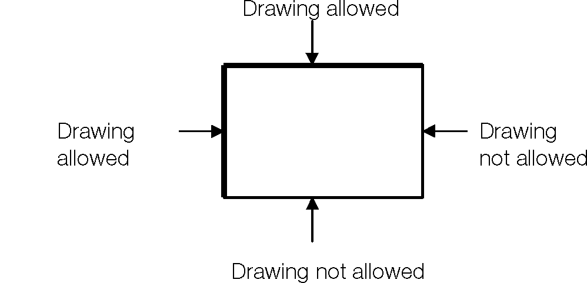
Это гарантирует, что пиксели вдоль границы полигона не будут рисоваться более одного раза, когда полигоны располагаются рядом друг с другом.
Дополнительную информацию о правилах рисования, связанных с наложением текстур, см. в разделе «Спецификация координат полигона текстуры».

# Заказ таблиц

Чтобы упростить управление порядком выполнения большого количества примитивов, графическая библиотека использует механизм, известный как таблица упорядочения (OT). Таблица заказа представляет собой вариант базового связанного списка, предназначенный для облегчения вставки примитивов рисования, которые представляют части трехмерного изображения.

Примитивы можно зарегистрировать в таблице упорядочения с помощью AddPrim() или AddPrims(). Зарегистрированные примитивы затем выполняются с помощью DrawOTag(). Поскольку DrawOTag() является неблокирующей функцией, ЦП может выполнять дальнейшую обработку, не дожидаясь завершения рисования графическим процессором.

OT состоит из массива указателей на примитивы, хранящиеся в основной памяти. Его размер определяется необходимым разрешением приоритета дисплея. Например, в следующем примере создается таблица заказов с 256 уровнями приоритета:

```c
unsigned long ot[256];
ClearOTag(ot, 256);	/* initialize the OT */
```

ClearOTag() преобразует базовый массив в простой связанный список, как показано ниже, где (EndofPrim) — специальное значение, используемое для обозначения конца списка примитивов:

```c
ot[0]-> ot[1] ->	... -> ot[255] -> (EndofPrim)
```

# Регистрация примитивов в OT

Перед рисованием примитивы должны быть зарегистрированы в OT с помощью AddPrim():

```c
AddPrim (ot + i, &prim); /* AddPrim(&ot[i], &prim);*/
```

Приоритет выполнения каждого примитива определяется его положением в OT. Примитивы в начале OT будут выполняться первыми (и, следовательно, отображаться дальше всего назад), а примитивы в конце OT будут выполняться последними (и, следовательно, отображаться дальше всего вперед).

В следующем примере примитивы p1 и p2 зарегистрированы в OT. Затем вызывается DrawOTag() для выполнения примитивов в таблице. p1 выполняется первым (отображается дальше всего на экране), а p2 выполняется последним (отображается дальше всего вперед, т. е. он перезаписывает все уже нарисованные примитивы).

```c
unsigned long ot[256];	 /*OT (256 entries)*/
Clear0Tag(ot, 256);	     /*OT initialization*/
AddPrim(&ot[0], p1);	 /*register primitive p1 in ot[0]*/
AddPrim(&ot[255], p2);   /*register primitive p in ot[255]*/ 
DrawOTag(ot);			/*execute primitives in OT*/
```
В одной записи OT может быть зарегистрировано несколько примитивов. В этом случае примитивы будут выполняться после того, как примитивы впоследствии будут зарегистрированы в той же записи. В следующем примере примитивы будут выполняться в порядке p0, p3, p2, p1, p4.

```c
AddPrim	(&ot[2],	p0);	/*register	in	ot[2]*/
AddPrim	(&ot[3],	p1);	/*register	in	ot[3]*/
AddPrim	(&ot[3],	p2);	/*register	in	ot[3]*/
AddPrim	(&ot[3],	p3);	/*register	in	ot[3]*/
AddPrim	(&ot[4],	p4);	/*register	in	ot[4]*/
```

# Регистрация специальных примитивов

Специальные примитивы можно использовать для переключения всей или части среды рисования в процессе рисования. Эти специальные примитивы, как и обычные примитивы, могут быть зарегистрированы в OT, а затем выполнены вместе с обычными примитивами с помощью функции DrawOTag().

Область применения специальных примитивов зависит от их местоположения в таблице заказа. В следующем примере настройка примитива env действительна для выполнения примитивов, зарегистрированных после ot[128]; поэтому только p2 получает влияние примитива env.

```c
AddPrim(&ot[0], &p1);       /*register drawing primitive p1*/ 
AddPrim(&ot[128], &env);	/*register special primitive env*/
AddPrim(&ot[255], &p2);	    /*register drawing primitive p2*/
DrawOTag(ot);
```
# Связывание примитивов без OT

Вы можете создать свой собственный связанный список примитивов вместо использования структуры таблицы упорядочивания. Такой список все еще может быть выполнен с помощью DrawOTag(). Например, следующий пример обеспечивает ту же операцию, что и DrawPrim().

```c
myDrawPrim(void *p) {
	
	TermPrim(p); /* terminate the primitive */ 
	DrawOTag(p); /* list and execute it. */
}
drawSprites(SPRT *p, int n) { 
	
	int i;
	
	for (i = 0; i < n-1; i++, p++)
		CatPrim(p, p+1);	/* link primitive p to primitive p+1 */
	
	TermPrim(p);
	DrawOTag(p);
}
```

Обратите внимание: когда вы связываете примитивы напрямую друг с другом, вы теряете гибкость структуры таблицы упорядочивания.


# Таблицы заказа и Z-сортировка

Вы можете использовать OT для реализации Z-сортировки, которая представляет собой метод устранения скрытых поверхностей путем сортировки списка примитивов по их глубине (z-значению) в трехмерном пространстве. Для этого вы вычисляете положение примитива в OT по его Z-значению, как показано в этом примере:

```c
unsigned long *ot[256];
AddPrim(ot+256-z0,p0);
```

В базовой библиотеке геометрии (libgte) многие функции вычисляют значение otz (чтобы помочь создать OT в Z-упорядочении) при выполнении трехмерного преобразования координат.

```c
SVECTOR x3, x2; int flg, otz;
otz = RotTransPers(&x3, (long*)&x2, &flg);

```


В этом случае функция RotTransPers() выполняет координатное и прозрачное преобразование трехмерных значений, на которые указывает x3, используя текущую матрицу, и сохраняет двухмерные координаты, полученные в x2. В то же время он возвращает индекс OT, называемый otz. Значение otz — это координата Z, деленная на 4; поэтому достаточно обеспечить ОТ с 1/4 динамического диапазона фактической Z-глубины. Используя Otz, можно выполнять трехмерную Z-сортировку на высокой скорости.

# Обратный ОТ

Переменная otz принимает большое значение для удаленных объектов; по мере их приближения значение приближается к нулю.

По этой причине необходимо инвертировать значение otz перед использованием его в качестве индекса в массиве OT. Чтобы избежать этого, библиотеки позволяют менять порядок записей в ОТ. Функция ClearOTagR() инициализирует ОТ в обратном порядке. Тогда порядок выполнения ОТ изменится.

Функция ClearOTag() инициализирует массив OT следующим образом:

```c
ClearOTag(ot, OTSIZE)
ot[0]-> ot[1] -> ot[2] -> ... -> ot[OTSIZE-1] -> (EndofPrim)
```
Функция ClearOTagR() инициализирует массив OT следующим образом:

```c
ClearOTagR(ot, OTSIZE)
ot[OTSIZE-1]-> ot[OTSIZE-2] -> ... -> ot[0] -> (EndofPrim)

```

При использовании ClearOTagR() параметры, которые вы передаете другим функциям, изменяются соответствующим образом, как показано в таблице ниже:

**Таблица 8-7: ОТ**
|||
|:--------:|:--------:|
|Using ClearOTag()|Using ClearOTagR()|
|\#define OTSIZE 1024|\#define OTSIZE 1024|
|unsigned long \*ot[OTSIZE];|unsigned long \*ot[OTSIZE];|
|.........|........|
|ClearOTag (ot,OTSIZE);|ClearOTagR (ot,OTSIZE);|
|.........|........|
|AddPrim (ot+OTSIZE-otz, &prim);| |
|AddPrim (ot+otz, &prim);| |
|.........|........|
|DrawOTag (ot);|


Обратите внимание, что указатели на OT выполняются по-другому при использовании ClearOTagR(). В частности, вычисления, необходимые для расчета индекса OT для функции AddPrim, проще, а поскольку эта функция, скорее всего, будет вызываться очень часто, результатом будет чистая экономия.

OT нормального порядка чаще всего используется для двумерных графических приложений, таких как игры на основе спрайтов, где положение каждого примитива не обязательно основано на положении в трехмерном пространстве. OT обратного порядка чаще используется для приложений трехмерной графики, где Z-глубина трехмерных расчетов более непосредственно соответствует позициям внутри OT.

OT обратного порядка инициализируется с помощью высокоскоростной аппаратной функции, тогда как OT нормального порядка инициализируется с помощью программного обеспечения. Из-за этого большие массивы OT инициализируются гораздо быстрее, если они расположены в обратном порядке.

# Объединение с функциями геометрии

Для отображения трехмерных объектов каждый объект разбивается на комбинации треугольников и четырехугольников, а координаты каждого многоугольника определяют положение соответствующего примитива, который необходимо нарисовать. Другими словами, координаты (x,y) примитива в буфере кадра получаются из трехмерных координат полигонального компонента объекта. Это преобразование координат выполняется библиотекой геометрии.

Движение/вращение объекта и движение/вращение точки обзора могут быть описаны в одной матрице вращения и векторе движения. Вершины многоугольников, из которых состоят объекты, описаны ниже.


**Рисунок 8-6: Формат вершин многоугольника**
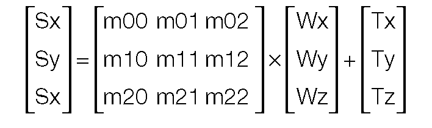

(Wx, Wy, Wz): - Положение координат в мировых координатах.
(Sx, Sy, Sz): - Положение координат в координатах экрана.
(m00,...,m22): - Матрица вращения


Нарисованный примитив на самом деле является проекцией на двумерную плоскость (экран). Экран представляет собой воображаемую плоскость, находящуюся на определенном расстоянии h от точки зрения. Этот процесс известен как перспективная трансформация.

**Рисунок 8-7: Перспективная трансформация**
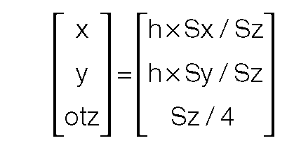


Здесь вычисленные (x, y) — это (x, y) члены примитива, а otz — запись OT. Подробности смотрите в документации libgte. Ниже приведен пример функции, выполняющей эту операцию.]

```c
void rotTransPersAddPrim(
		SVECTOR *pos;	/*position*/
		SPRT *sp;	/*Sprite primitive*/
		unsigned long *ot;	/*OT*/
		int ot_size)	/*size of OT*/
		
{
		long otz, dmy, flg;
		otz = RotTransPers(&( pppos->x[0],, (long*)sp ->x0,&dmy,&flg);
		if (otz > 0 && otz < ot_size) AddPrim(ot+otz, sp); }

```

# Несколько ОТ

При желании весь ОТ можно вставить в другой ОТ. Этот метод действителен для одновременного использования более чем одной иерархической системы координат.

Следующий пример соединяет дочерний OT ot1 длиной n с родительским OT ot0.

```c
AddOT(unsigned long *ot0, unsigned long *ot1, int n) {
		AddPrims(ot0, ot1, ot1+n-1);
}
```

Однако, поскольку назначение ссылки для ot1[n-1] заменяется назначением ссылки ot0 в AddPrims(ot0, ot1+n-1), в некоторых случаях примитив, связанный с ot1[n-1], не отображается. В результате примитив не должен быть зарегистрирован в последней записи ot1.

# Синхронизация и сброс

## Сброс

Чтобы сбросить графическую систему, вызовите ResetGraph(). Эта функция принимает один параметр, который определяет уровень сброса. Все уровни немедленно прерывают выполняемую команду рисования, отменяют все запросы, оставшиеся в очереди, и переходят в состояние ожидания.

• Уровень 0 ( ResetGraph (0) ) Полностью сбрасывает графическую систему. Его следует выполнить только один раз, при активации программы. Команда рисования и команды очереди отменяются, а обратные вызовы инициализируются. Режим отображения инициализируется с разрешением 256x240, а отображение замаскировано (экран становится черным).
• Уровень 1 ( ResetGraph (1) ) Отменяет команду, выполняемую в данный момент, и команды, оставшиеся в очереди. Среда рисования и среда отображения сохраняются. Этот уровень часто используется при переключении двойного буфера.
• Уровень 3 ( ResetGraph (3)) Эквивалент полного сброса уровня 0, за исключением того, что среда отображения и среда рисования сохраняются. Кроме того, дисплей не маскируется. Этот уровень используется для инициализации всех дочерних процессов при сохранении состояния экрана дисплея, установленного родительскими процессами. При передаче управления от родительских процессов к дочерним процессам с помощью Exec() необходим полный сброс для переключения обратного вызова, но при сбросе уровня 0 также инициализируется отображение. Таким образом, если синхронизация отображения отсутствует, экран будет искажаться при переходе к дочерним процессам. Чтобы избежать этого, дочерние процессы следует инициализировать в начале с помощью ResetGraph(3), а не ResetGraph(0).

Ниже приводится краткое изложение вышеуказанных пунктов:

**Таблица 8-8: Уровни сброса**

|Уровень сброса|Обратный вызов|DISPENV|DRAWENV|Очередь команд|
|--------------|--------------|-------|-------|--------------|
|0|Инициализировать|Инициализировать|Инициализировать|Инициализировать|
|1|Сохранять|Сохранять|Сохранять|Инициализировать|
|3|Инициализировать Сохранять|Сохранять|Инициализировать|

## Синхронизация

Чтобы обеспечить плавное отображение, программам необходим способ синхронизировать свои графические операции (и другую обработку) с периодом вертикального пустого изображения на видеодисплее. Кроме того, программам необходим метод обнаружения окончания операций рисования, выполняемых в фоновом режиме; то есть неблокирующие функции, такие как DrawOTag().

Существует два метода обнаружения возникновения асинхронных событий:

• Опрос: то есть проверка того, произошло ли событие.
• Обратные вызовы: настройка функций, которые автоматически выполняются при возникновении события.

## Опрос

Функция DrawSync() позволяет обнаружить окончание операций рисования. Он имеет следующие параметры:

• DrawSync (0) — блокируется до тех пор, пока не будут завершены все запросы, оставшиеся в очереди.
• DrawSync (1) — возвращает количество позиций в очереди рисования.

Функция VSync() позволяет обнаружить следующий период вертикального пробела, а также предоставляет другую информацию. Его можно использовать несколькими разными способами:


• VSync (0) — блокируется до начала следующего вертикального пустого периода.
• VSync (1) — возвращает количество единиц горизонтальной синхронизации с момента предыдущего вызова VSync(0) или VSync(n).
• VSync (n) — если n>0, ожидание n-го периода вертикального пробела. (VSync(0) ожидает следующего периода VB. VSync(2) ожидает второго периода VB и т. д.)
• VSync (-n) — где n<0, возвращает количество вертикальных пустых периодов с момента запуска программы.

## Обратные вызовы

Обратный вызов — это функция, которая вызывается после завершения фоновой обработки. Libgpu предоставляет две функции, позволяющие регистрировать обратные вызовы:

**Таблица 8-9: Функции регистрации обратного вызова libgpu**

|Имя функции|Тригер|
|-----------|------|
|VSyncCallback()|Вертикальная синхронизация|
|DrawSyncCallback()|Завершение рисования|

DrawSyncCallback позволяет определить функцию, которая вызывается по завершении неблокирующей операции рисования, такой как DrawOTag().

VSyncCallback() позволяет определить функцию, которая вызывается в начале вертикального пустого периода. Эту функцию можно использовать для переключения дисплея с одного буфера на другой и для выполнения других графических операций, которые должны быть синхронизированы таким образом.

```C
int buffer=0;				/*Индикатор активного буфера*/
int new_frame_is_ready=0;	/*флаг "готовности к переключению буферов"*/

:
:

void main (){				/*здесь введена процедура инициализации*/

	:
	:
	VSyncCallback(vbcallback); /*определяет процедуру обратного вызова*/
	:
	:
}

void vbcallback(){

	if (new_frame_is_ready){ 	/*Это установлено в нашем*/
								/*Функция DrawSyncCallback*/
								/*(здесь не показано)*/
							
		buffer=1-buffer;		/*Переключить буферы*/
		PutDispEnv(&db[buffer].disp);
		PutDrawEnv(&db[buffer].draw);
		new_frame_is_ready=0;	/*Сбросить флаг*/
	}
}
```
В следующем коде процедура обратного вызова увеличивает счетчик. Процедура MyVSync(), повторяющаяся до тех пор, пока счетчик не изменится, функционально эквивалентна Vsync(0).

```c
void main(){
	/* Здесь введена процедура инициализации */
		VSyncCallback(callback);   /* Определить обратный вызов */
		while(1){
			/* Обработка осуществляется в пределах введенного здесь кадра */
			MyVSync();
		}
	}
	static volatile int Vsync_Count=0; /* Счетчик вертикальной синхронизации */
	
	void MyVSync(void){		/* Блокируется до тех пор, пока не будет обновлена переменная Vsync_Count. */

		int i =Vsync_Count;
		while (i==Vsync_Count);
	}
	
	void callback(){  /* Счетчик увеличивается при запуске вертикальной синхронизации. */

		
		Vsync_Count++;
	}
```

## Синхронизация кадров

Чтобы избежать мерцания экрана, буферы рисования и отображения следует переключать одновременно с вертикальной синхронизацией. Для этого используются DrawSync() и Vsync().

```c
/* (1) После завершения рисования ждет следующей вертикальной синхронизации и начинает следующее рисование */

DrawSync(0);
Vsync(0);
Draw0Tag(ot);

/* (2) Независимо от того, завершился отрисовка или нет, ждет следующей вертикальной синхронизации и начинает следующий отрисовку */

Vsync(0);
ResetGraph(1);
Draw0Tag(ot);

/* (3) Независимо от того, завершилось ли рисование или нет, ждет, пока следующие 2 вертикальные синхронизации и начинается следующий рисунок */

Vsync(2);
ResetGraph(1);
Draw0Tag(ot);

```

Обратите внимание, что прорисовка со скоростью 60 кадров в секунду в примере (2) не гарантируется. Отрисовка в 60 кадров может быть достигнута только тогда, когда обработка процессора завершается через 1/60 секунды. Также обратите внимание, что в примере (3) отсчет ведется от Vsync, вызванного непосредственно перед блоками Vsync(2) для двух блоков кадров.

## Двойной буфер пакетов

Общий термин для области памяти, используемой для OT и примитивов, — буфер пакетов.

Ожидание отрисовки примитивов после их регистрации в OT делает невозможным параллельную работу ЦП и графической системы. Доступ к примитивам и OT невозможен для ЦП до тех пор, пока графическая система не завершит их обработку.

**Рисунок 8-8: Рисунок после регистрации в OT**
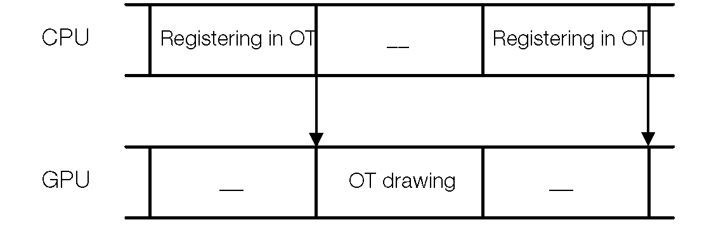

Для параллельной работы графической системы и ЦП требуются два буфера пакетов: один используется для хранения OT и генерируемых в данный момент примитивов, другой используется для OT и примитивов, которые были сгенерированы ранее и которые теперь выполняются графической системой. . Два буфера пакетов поочередно берут на себя задачи рисования и выполнения. Это называется системой двойного буфера пакетов.

**Рисунок 8-9: Двойной буфер пакетов**
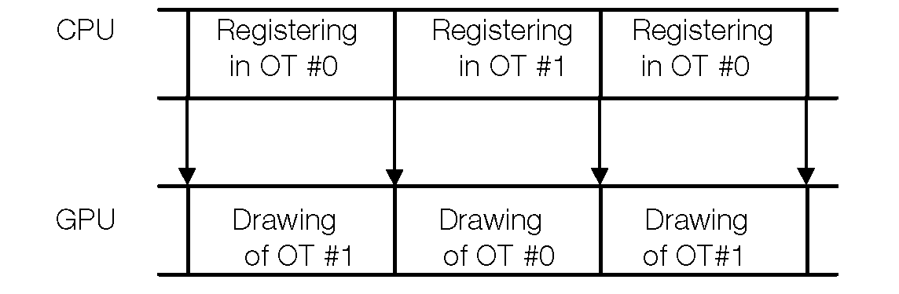

Это двойной буфер пакетов. Ниже приведен пример двойного буфера пакетов. OT и примитив должны быть объединены вместе при использовании двойного буфера пакетов.

```c
typedef struct{

	unsigned long ot[256];		/*OT*/ 
	SPRT sprt[256];				/*Sprite primitive*/
}DB;

void main(){
	
	int j;
	DB db[2], *cdb;
	cdb=db[0];
	
	while(1){
		
		cdb=(cdb==db) ? db+1 : db; /*switch buffers*/
		ClearOTag(cdb->ot); /*clear OT*/
		
		for(j=0; j<256; j++){	/*register Sprites	in OT*/
			/*at this point, calculate the Sprite position*/
			AddPrim(cdb->ot, cdb->sprt[j];
		}
		
		DrawOTag(cdb->ot);	/*Draw*/
	}
	
}		
```

## Асинхронный двойной буфер

Обычно двойной буфер пакета переключается по завершении рисования. Однако при использовании режима чересстрочной развертки рисунок должен обновляться каждые 1/60 секунды, независимо от времени расчета/рендеринга. В таких случаях для принудительного выполнения перерисовки можно использовать обратные вызовы.

```c
/*Asynchronous DrawOTag:
*The specified OT waits for the next VSync and is executed.
*/

void main (){
		......
		
		VSyncCallback(callback);
		......
		
		while (1){
			/*Create primitive list*/
				DrawSync(0);
				make_packet();

				unsyncDrawOTag(ot);
			}
}

static void *completed_ot = 0; 

void unsyncDrawOTag (void *ot){

		completed_ot = ot;
}
void callback (void) {

		if (completed_ot) { 
				
				ode_patch(); 
				ResetGraph (1);	/* stop drawing */
				DrawOTagR (completed_ot); /* 
		} 
} /*Patch for interlace double buffer. */ 

static void ode_patch (void) { 
	
	static int ode = 0; 
	DRAWENV draw;
	GetDispEnv (&draw); 
	
	if (draw.dfe) {
		
		while (GetODE() ==ode);
		ode = (ode+1) &0x01; 
	} 
}
```
В этом примере DrawOTag выполняется в каждом поле независимо от загрузки ЦП. Однако если обновление ОТ не было выполнено вовремя, предыдущее ОТ будет использовано повторно.

Примечание. Целью ode_patch() является устранение проблем с синхронизацией VSync при переключении нечетных/четных полей в чересстрочном режиме; подробности см. в разделе «Синхронизация VSync в чересстрочном режиме».

## Наложение текстур

Отображение текстур — это метод отображения двумерного растрового изображения, известного как текстурный узор, на поверхности треугольников и четырехугольников.

Текстуры хранятся в областях буфера кадра (за пределами областей отображения и рисования), называемых страницами текстур. Страница текстуры состоит из растрового изображения размером 256 x 256. Его верхняя левая координата X в буфере кадра должна быть кратна 64, а координата Y кратна 256. (Поэтому страницы текстур могут перекрываться по горизонтали.)

## Формат текстурного патерна

В шаблонах текстур используются три режима формата пикселей, как показано в таблице ниже. Каждый примитив может иметь свой режим.

**Таблица 8-10: Режимы текстурного рисунка**

|Режим|Тип|Цвета|Ширина страницы текстуры|
|-----|---|-----|------------------------|
|4-bit|на основе CLUT|16|64|
|8-bit|на основе CLUT|256|128|
|16-bit|Прямой RGB|32767|256|

В 16-битном режиме значение пикселя из текстуры используется напрямую: 15 бит используются для информации о цвете RGB, что позволяет использовать 32767 цветов, плюс 1 бит для указания полупрозрачного статуса этого пикселя.

В 4-битных и 8-битных режимах текстуры используется таблица поиска цветов (CLUT), также известная как палитра, для указания фактических значений цвета. Каждое значение пикселя в этих режимах используется как индекс соответствующего CLUT. Сам CLUT представляет собой серию 16-битных значений пикселей, расположенных в горизонтальном формате внутри кадрового буфера. Каждое 16-битное значение пикселя представляет один из цветов, которые будут использоваться для текстуры. Для 4-битной текстуры требуется CLUT с 16 последовательными записями, а для 8-битной текстуры требуется CLUT с 256 последовательными записями.

16-битные текстуры хранятся по одному пикселю на 16-битное слово, в то время как 8-битные текстуры хранят 2 пикселя в каждом слове, а 4-битные текстуры хранят 4 пикселя в каждом слове, как показано на рисунке ниже. Поскольку шаблон текстуры размером 256 x 256 пикселей размещается на одной странице текстуры, площадь, фактически занимаемая страницей текстуры в буфере кадра, варьируется от 256 x 256 (16-битный режим) до 64 x 256 (4-битный режим).

**Рисунок 8-10: Формат текстурного патерна**
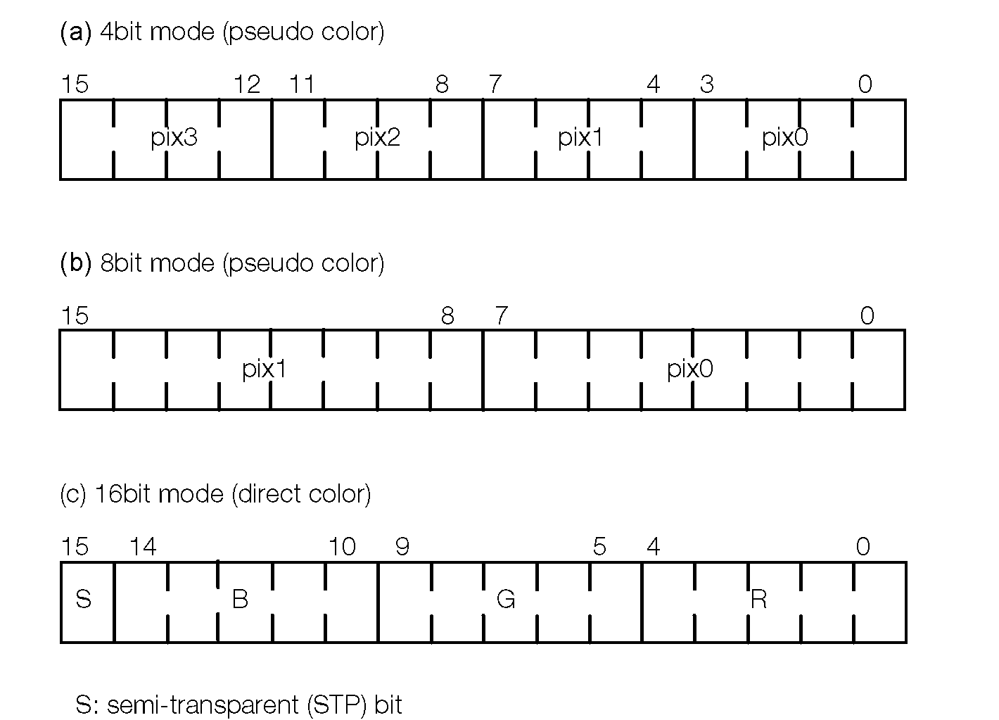

При использовании 4-битных и 8-битных текстур координаты текстурного шаблона (U,V) и координаты в буфере кадра не будут напрямую сопоставляться друг с другом. При использовании LoadImage() необходимо соблюдать осторожность при загрузке шаблонов текстур в буфер кадра. То же самое относится к MoveImage() и StoreImage().

Прямоугольная область, указанная для этих функций, основана на стандартных координатах кадрового буфера с использованием 16-битных пикселей. Для 4-битных текстур ширину прямоугольника необходимо разделить на 4. Для 8-битных текстур ее необходимо разделить на 2. Это означает, что 8-битные текстуры должны быть кратны 2 пикселям по ширине, и что 4-битные текстуры должны быть кратны 2 пикселям по ширине, а 4-битные текстуры должны быть разделены на 2. Ширина текстур должна быть кратна 4 пикселям.

Следующий пример кода иллюстрирует наложение текстуры на четырехугольник:

```c
POLY_FT4 ft4;
SetPolyF4(&ft4); 						/*initialize primitive */
ft4.tpage = GetTpage (0, 0, 640, 0); 	/*texture page = (640,0)*/
ft4.clut = GetClut (0, 480);			/*texture CLUT = (0, 480)*/

/* texture pattern within the	(x,y) = (0,0) -	(256, 256)	is */
/* textured mapped to (u,v) =	(0,0)-(128,128)	within the	*/
/* texture page */

setXY4(&ft4, 0, 0, 256, 0, 0,	256, 256, 256);
setUV4(&ft4, 0, 0, 128, 0, 0,	128, 128, 128);

DrawPrim(&ft4);							/*execute primitive*/
```

Примечание. GetTPage() и GetClut() требуют, чтобы функция LoadImage() использовалась для предварительной загрузки текстуры и текстуры CLUT. LoadTPage() и LoadClut() загружают страницу текстуры и CLUT текстуры и возвращают идентификатор страницы текстуры и идентификатор CLUT текстуры соответственно.

CLUT текстуры могут быть установлены независимо для каждого примитива, независимо от используемой текстуры. Несколько текстур могут использовать один и тот же CLUT. 4-битная текстура может использовать любые 16 записей из более крупного CLUT.


### Установка текущей страницы текстуры

В отличие от полигонов, примитивы спрайтов (SPRT) не указывают страницу текстуры. Поэтому при выполнении спрайтов вы должны убедиться, что текущая страница текстур установлена правильно.

Вы можете указать начальную текущую страницу текстуры в среде рисования. Специальный примитив DR_MODE можно использовать для явного изменения текущей страницы текстуры. Это переключает текущий режим страницы текстуры.

```c
DR_MODE dr_mode;			/*mode primitive*/
SPRT16 sprt;				/*16 x 16 Sprite primitive*/
SetDrawMode(*&dr_mode, 0, 0, GetTPage(2, 0, 640, 0), 0);
SetSprt16(&sprt);
setXYO(&sprt, 100, 100);
ClearOTag(ot, 2);
AddPrim(ot + 1, &sprt);		/*register SPRT16 in ot[1]*/
AddPrim(ot + 1, &dr_mode);	/*register DR_MODE in ot[1]*/
DrawOTag(ot);
```

Обратите внимание, что в одной записи OT зарегистрированы два примитива. Последний зарегистрированный (DR_MODE) выполняется первым.

### Прозрачные пиксели и полупрозрачные пиксели

Вы можете выбрать прозрачный, непрозрачный или полупрозрачный цвет для каждого пикселя при наложении текстуры. Старший бит (бит 15) каждого значения пикселя (или соответствующая запись CLUT в 4- и 8-битном режиме) является битом полупрозрачности (STP).

Когда значение пикселя шаблона текстуры равно 0x0000 (STP, R, G и B равны нулю), пиксели прозрачны и, следовательно, не рисуются.

Пиксели с битом STP, установленным в 1, будут отображаться как полупрозрачные, если примитив, на который они отображаются, установлен в полупрозрачный режим с помощью функции SetSemiTrans(). Пиксели, у которых бит STP установлен в 0, но не у которых R, G и B не равны нулю, всегда будут непрозрачными.

**Таблица 8-11: Прозрачные/полупрозрачные пиксели**

|STP, B, G, R|(0, 0, 0, 0)|(1,0, 0, 0)|(0, n, n, n)|(1, n, n, n)|
|------------|------------|-----------|------------|------------|
|Непрозрачный примитивный|Прозрачный|Черный|Непрозрачный|Непрозрачный|
|Полупрозрачный примитивный|Прозрачный|Полу-прозрачный|Непрозрачный черный|Полу-прозрачный|

Примитивы, которые не используют отображение текстур, также могут быть переведены в полупрозрачный режим с помощью SetSemiTrans(). В этих случаях все пиксели примитива будут полупрозрачными.

Примечание. Скорость обработки полупрозрачных полигонов сильно снижается, поскольку существующие пиксели в буфере кадра необходимо считывать, обрабатывать и затем записывать обратно.

Скорости полупрозрачных примитивов указаны в примитивных единицах. Ниже приведен список ставок полупрозрачности, которые могут быть указаны.

**Таблица 8-12: Уровень полупрозрачности**
|Значение яркости фона|Примитивное значение яркости|
|---------------------|----------------------------|
|0.5|0.5|
|1.0|1.0|
|1.0|-1.0|
|1.0|0.25|

Значение яркости обрезается, когда оно превышает максимальное значение. Могут использоваться уровни полупрозрачности, заданные страницей текстуры, указанной с помощью примитива DR_MODE. Та же скорость применяется к примитивам, которые не выполняют наложение текстур.

Дополнительную информацию смотрите в разделе «Примитивные атрибуты» выше.

### Примитивные значения яркости текстурного отображения

В случае примитива с отображением текстуры значение яркости шаблона текстуры пикселей многоугольника задается элементами (r, g, b) примитивов. Эти значения, взятые вместе, составляют фактическое значение яркости.

Значение яркости рисуемого пикселя вычисляется на основе соответствующего значения пикселя текстурного рисунка и значения яркости, заданного элементами (r,g,b) примитива, как показано ниже:

T = Значение пикселя текстурного рисунка

L = Значение яркости пикселя, заданное полями R,G,B примитива.

P =	(T*L)/128

Другими словами, если все поля (r, g, b) примитива установлены на 128, то все нарисованные пиксели будут иметь то же значение яркости, что и исходная текстура. Если полученное значение яркости (P) превышает 255, оно будет обрезано до максимального значения 255.

Либо члены r, g, b должны быть установлены, либо эта опция должна быть запрещена с помощью функции SetShadeTex() при инициализации примитива отображения текстуры.

```c
POLY_FT4 ft4;
SetPolyFT4(&f4);	/*initializes the primitive*/
SetRGB0(&fT4, 0x80, 0x80, 0x80); /*initializes the RGB values*/ /*or*/
SetShadeTex( &ft4, 1 );	/*inhibit shading*/
```

### Повторяющиеся текстуры

Можно установить одну часть страницы текстуры в качестве окна текстуры и внутри этого пространства обернуть (повторить) шаблон текстуры.

Установка окна текстуры может быть выполнена при настройке среды рисования через поле tw структуры DRAWENV или с помощью примитива DR_MODE. Пожалуйста, обратитесь к следующему примеру.

Окна текстур обычно установлены на (0,0) – (255, 255), что приводит к тому, что текстура не повторяется. Установка окна текстуры на меньшую область приведет к тому, что текстура будет повторяться по мере необходимости при рисовании примитива.

При указании окна текстуры для повторения текстуры координаты текстуры (U,V) примитива должны находиться внутри окна текстуры.

```c
u_short tws[2], twe[2];
DR_MODE dr_mode;	/*drawing mode primitive*/
tws[0] = tws[1] = 32;	/*texture window (32,32)-(64,64)*/
tws[0] = tws[1] = 64;
/*initialization drawing mode primitive*/
SetDrawMode(&dr_mode,0,0, GetTPage(0, 0, 640, 0), tws, twe );
```

### Кэш текстур

При рендеринге многоугольника с текстурой образец текстуры необходимо считывать из буфера кадра. Для повышения скорости рендеринга графический процессор PlayStation содержит высокоскоростной кэш текстур размером 2 КБ. Когда используются текстуры, они считываются из буфера кадра в кеш. Последующие использования тех же пикселей текстуры (текселей) считываются непосредственно из кэша, что намного быстрее, чем чтение из буфера кадра.

Как и буфер кадра, текстуры в кэше текстур ссылаются на двумерные адреса. Эти адреса зависят от режима пикселей рисуемого многоугольника. В следующей таблице показаны размеры кэша для каждого режима пикселей:

**Таблица 8-13: Размер кэша текстур**

|Пиксельный режим|Размер (ширина х длина)|
|----------------|-----------------------|
|4 бит/пиксель|64x64|
|8|64x32|
|16|32x32|

## Примитивная скорость рендеринга

Чтобы улучшить скорость рендеринга на PlayStation, необходимо определить, что медленнее: скорость рендеринга графического процессора или скорость вычислений процессора. Это можно определить, вызвав DrawSync().

• Если узким местом в скорости является ЦП, DrawSync() немедленно возвращается.
• Если узким местом в скорости является графический процессор, функция DrawSync() блокируется; то есть он не возвращается немедленно.
• Время ожидания DrawSync() является мерой задержки в графическом процессоре.

Когда узкое место находится в графическом процессоре, оптимизация программного кода не улучшит производительность, поэтому необходимы средства для повышения скорости рендеринга.

В этом разделе объясняются некоторые факторы, определяющие производительность рендеринга графического процессора, а также общие методы повышения скорости рендеринга.

В PlayStation кадры сначала визуализируются в буфере кадров, а затем выводятся на дисплей. Таким образом, производительность рендеринга может быть определена, по существу, по количеству операций чтения и записи во VRAM (видеопамять).

Скорость рендеринга (выполнения) конкретного примитива зависит от его площади и типа. Примитивный рендеринг состоит из повторяющихся операций чтения и записи в кадровый буфер VRAM. Чем больше площадь примитива, тем больше объём записанной видеопамяти и, следовательно, тем больше время рендеринга. Полупрозрачный рендеринг выполняется медленнее, чем непрозрачный рендеринг того же примитива, поскольку полупрозрачный рендеринг требует доступа для чтения, а также доступа для записи.

**Рисунок 8-11: Примитивная скорость рендеринга**
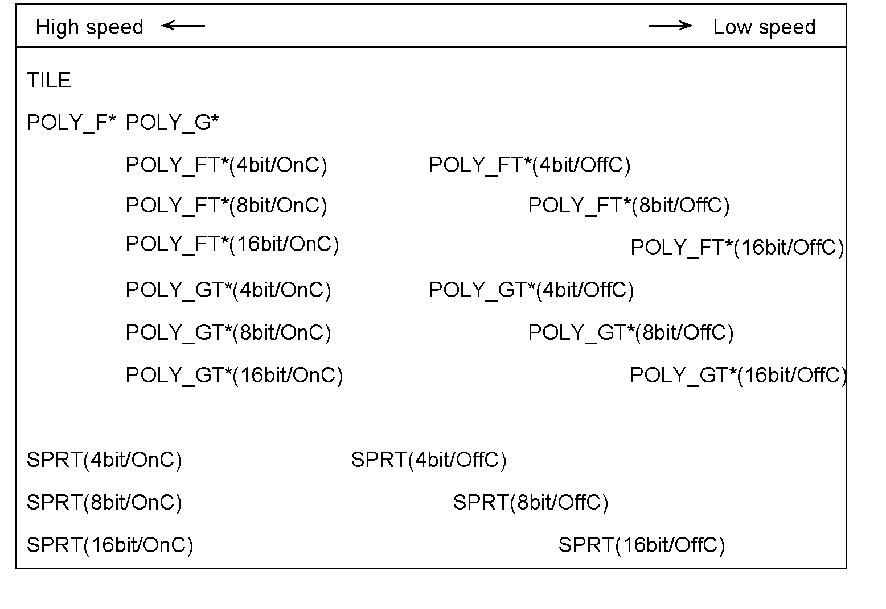

OnC указывает, что кэш текстур находится в состоянии попадания, а OffC указывает, что кэш текстур находится в состоянии отсутствия, а 4 бит/8 бит/16 бит указывает на режим текстуры. Скорость рендеринга всегда выше при попадании в кеш, а когда кеш текстур находится в состоянии промаха, текстура в 4-битном режиме быстрее, чем 8-битная, что быстрее, чем 16-битная.


## Правила доступа

Примитивная скорость рендеринга может быть рассчитана на основе цикла доступа к буферу кадра.

Как только все примитивы будут отображены в буфере кадра, они отображаются. Производительность рендеринга связана с частотой доступа для чтения и записи к буферу кадра.

### Основные правила

Доступ на запись в буфер кадра напрямую соответствует операции рендеринга. Доступ для чтения к буферу кадра осуществляется при чтении шаблона текстуры и в полупрозрачном режиме. Правила циклов доступа следующие.

**Таблица 8-14: Циклы доступа**
|Направление доступа|пикселей/цикл|Примечания|
|-------------------|-------------|----------|
|Запись|2|SPRT,TILE,POLY_F3,POLY_F4|
| |1|Другое|
|Чтение|1|Наложение текстур полупрозрачный рендеринг|

Например, ниже показано количество циклов, необходимое для рендеринга POLY_G4 100x100 и POLY_F4 100x100.

**Таблица 8-15: Количество циклов доступа**
|Примитивный тип|POLY_G4|POLY_F4|
|---------------|-------|-------|
|Общее количество пикселей|100x100=10000|100x100=10000|
|Общее количество чтения|0|0|
|Общее количество записей|10000|5000|
|Всего циклов|10000|5000|

### Наложение текстур

Вычислить скорость рендеринга текстурных карт чрезвычайно сложно. Однако сначала мы можем рассмотреть простой промах/попадание в текстуру, где отображение составляет 1:1. В 4-битном шаблоне текстуры четыре текселя (текстурных пикселя) упакованы в одно 16-битное слово. Таким образом, четыре текселя можно прочитать вместе за один доступ. Аналогично, при 8-битном шаблоне текстуры одновременно считываются два текселя.

В случае POLY_FT4 100x100:

**Таблица 8-16: Количество циклов в POLY_FT4**
|Режим|4-битный|8-битный|16-битный|
|----|-----|-----|------|
|Общее количество чтений|10000/4=2500|10000/2=5000|10000|
|Общее количество записей|10000|10000|10000|
|Всего|12500|15000|20000|

В случае SPRT 100x100:

**Таблица 8-17: Количество циклов в SPRT**
|Режим|4-битный|8-битный|16-битный|
|----|-----|-----|------|
|Общее количество чтений|10000/4=2500|10000/2=5000|10000|
|Общее количество записей|5000|5000|5000|
|Всего|7500|10000|15000|

Из этой презентации видно, что 4-битные текстуры самые быстрые.

### Зависимости коэффициента увеличения текстуры


