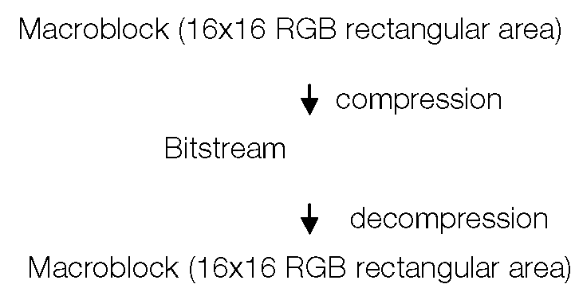
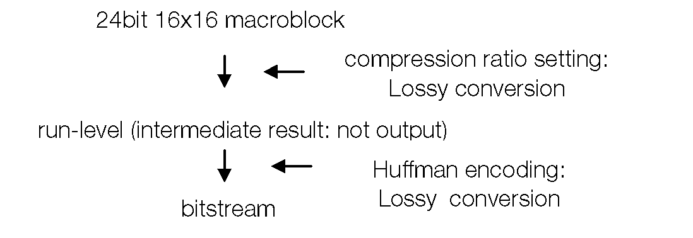
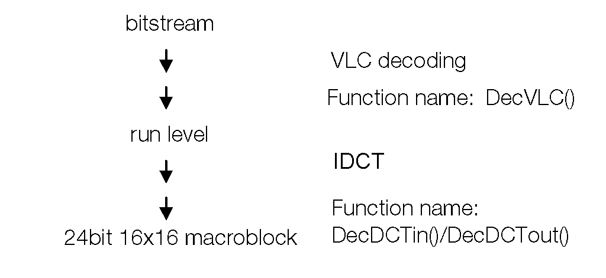

# Библиотека сжатия данных

# Обзор

Библиотека сжатия данных (libpress) — это библиотека функций низкого уровня для сжатия (кодирования) и распаковки (декодирования) изображений и звуковых данных.
Данные изображения, которые можно сжимать и распаковывать, включают в себя:
- Одиночные изображения.
- Кадры из видеоряда, сжатые в формат PlayStation MDEC.
MDEC — это настроенная часть оборудования PlayStation, специализирующаяся на распаковке изображений.
Доступны три метода сжатия изображений:
- DCT (дискретное косинусное преобразование) можно использовать для сжатия цветных изображений.
- BVQ (блочное векторное квантование) аналогичным образом объединяет количество цветов в прямоцветном изображении.
вместе, чтобы создать 256/16 цветов.
- Кодировка Хаффмана (фиксированная кодовая книга) обратимо сжимает 4-битные индексные цвета.
Для сжатия звуковых данных библиотека использует ADPCM для сжатия 16-битного прямого PCM примерно до 1/4. Сжатые звуковые данные можно использовать в качестве данных источника звука SPU.

## Библиотека и заголовочные файлы

Имя файла библиотеки сжатия данных — libpress.lib; чтобы использовать библиотечные услуги, вы должны установить связь с этим файлом. Заголовок библиотеки — libpress.h; программы, вызывающие библиотечные процедуры, должны включать этот файл.

# Функции компрессора и декомпрессора

Функции компрессора сжимают данные изображения и звука в основной памяти и возвращают результаты в основную память. Функции сжатия используются, когда данные необходимо сжимать динамически внутри приложения, а также когда данные генерируются автономно путем удаленной активации из среды разработки. Фактически, в локальной среде имеется встроенная схема DCT, которую можно использовать для высокоскоростного сжатия изображений с помощью DCT.

Функции декомпрессора расширяют сжатые данные в реальном времени. Обратите внимание, что в некоторых случаях функции сжатия создают форматы данных, которые обрабатываются без преобразования, а с помощью оборудования локальной среды, такого как BVQ. Данные в этих форматах не могут обрабатываться функциями распаковки.

# MDEC

PlayStation предоставляет специализированный механизм отображения данных MDEC (Motion DECoder) для высокоскоростного расширения данных изображения. MDEC расширяет сжатые данные в основной памяти и возвращает результат обратно в основную память. Этот результат передается в область отображения кадрового буфера и отображается в виде изображения.


Рисунок 7-1: Расширение и отображение данных с помощью MDEC


Доступ к основной шине, сохраненный в основной памяти, осуществляется путем разделения времени с ЦП и другим периферийным оборудованием и может выполнять обработку расширения параллельно с передачей программы и кадрового буфера и т. д.

# Сжатие данных изображения

Алгоритмы, используемые для сжатия данных изображения, различаются в зависимости от типа и предполагаемого использования данных.


## DCT (Дискретное косинусное преобразование)

DCT — это метод сжатия, используемый в JPEG/MPEG. Он сжимает изображения с прямым цветом (24/16 бит) с высоким коэффициентом эффективности. Сжатие происходит с потерями, но степенью сжатия можно управлять по желанию. Указанная степень сжатия обычно составляет от 5% до 10%.

В DCT базовым процессором является 24-битное изображение прямого цвета размером 16x16, называемое макроблоком. Все изображения разбиваются на макроблоки перед сжатием в формат битового потока. Выходные данные декомпрессии также выражаются в единицах макроблоков.

Например, когда данные изображения размером 320x240 разбиваются на большое количество макроблоков 16x16, как показано ниже, каждый из них сжимается в битовые потоки.

Рисунок 7-2. Разбивка изображений размером 320x240.


Рисунок 7-3: Обработка DCT


## BVQ (блочное векторное квантование)

BVQ выполняет векторное квантование изображений с прямым цветом, комбинируя цвета, чтобы получить в общей сложности 256 или 16 цветов и создание 8-битных или 4-битных изображений индексных цветов.

Изображения индексных цветов выражаются в виде двумерного массива, состоящего из CLUT (таблицы поиска цветов), которая дает фактические значения яркости, и индекса CLUT.

Изображения индексных цветов позволяют несколько больше сократить общий объем данных, чем эквивалентные изображения прямого цвета. Например, если значение яркости отдельных пикселей изображения равно 16 или ниже, индекс занимает всего 4 бита. Таким образом, объем изображения индексного цвета можно сжать до 25% от объема 16-битного изображения прямого цвета.

4-битные/8-битные индексные цвета могут использоваться как 4-битные/8-битные текстурные шаблоны, что устраняет необходимость в специальном фильтре декомпрессии.

В BVQ изображение при сжатии разбивается на несколько небольших областей, и векторное квантование выполняется на каждой небольшой области, что позволяет уменьшить количество цветов путем их комбинирования. На этом этапе векторное квантование снова выполняется на CLUT, сгенерированном для каждой небольшой области, поэтому количество CLUT также можно уменьшить путем комбинирования. В этом случае каждый пиксель данных изображения индексируется дважды: один раз по номеру CLUT, принадлежащему небольшой области, к которой принадлежит пиксель, и по значению индекса для этого CLUT.

Векторное квантование, при котором ссылка на индекс выполняется поэтапно таким образом, называется блочным векторным квантованием.

## Кодирование Хаффмана

Сжатие и распаковка DCT и BVQ осуществляется с потерями. Поэтому предусмотрена функция кодирования Хаффмана для обратимого сжатия 4-битных индексных цветов. Кодировка Хаффмана — это классический тип, в котором кодовая книга генерируется один раз в начале.

Кодирование Хаффмана сжимает данные путем присвоения кодов с короткой длиной кода (коды Хаффмана) по порядку, начиная со значений пикселей (значений индекса), которые появляются наиболее часто. Таблица, показывающая фактические значения пикселей и соответствующие им коды Хаффмана, называется кодовой книгой.

Степень сжатия кода Хаффмана варьируется в зависимости от характера исходного изображения. Как правило, чем больше поляризация отображаемых значений пикселей, тем выше будет степень сжатия.

В следующей таблице приведены методы сжатия и распаковки:

Таблица 7-1: Алгоритмы сжатия и распаковки

| |DCT|BVQ|Хаффмана|
|---|---|---|-----|
|Тип|С потерями|С потерями|Без потерь|
|Формат ввода|24-бит/16-бит|24-бит/16-бит|4-битный|
|Выходной формат|БитСтрим|4-бит/8-бит|БитСтрим|
|Коэффициент сжатия|От 10% до 5%|От 50% до 25%| |


# DCT (Дискретное косинусное преобразование)

## Основные принципы

### Сжатие

DCT принадлежит к категории линейных преобразований, обычно называемых прямыми преобразованиями, и его можно рассматривать как своего рода частотное преобразование.

Когда преобразование DCT выполняется на прямоугольном изображении NxN, низкочастотные составляющие этого изображения концентрируются в одном месте. Сжатие данных достигается за счет кодирования результатов по методу Хаффмана. Короче говоря, DCT — это метод, упрощающий сжатие данных, который сам по себе не уменьшает размер данных. Фактическое сжатие данных осуществляется с помощью кодирования Хаффмана.

Когда преобразование DCT выполняется для обычного изображения, частотные составляющие концентрируются в нижней области, поэтому после преобразования большинство составляющих имеют значение 0. Это означает, что может быть достигнут гораздо более высокий коэффициент сжатия, чем если бы изображение было Непосредственно закодировано по Хаффману. Этот тип кодирования Хаффмана называется VLC (кодирование переменной длины).

Граница байт/слов данных, обработанных VLC, логически бессмысленна, и данные выражаются просто как поток битов. Это известно как битовый поток.

Базовой единицей всех процессов в этой последовательности является прямоугольная область размером 16x16. Этот блок известен как макроблок. Соответственно, при сжатии DCT макроблоки могут быть введены, сжаты и преобразованы в формат битового потока.

После того, как изображение подверглось преобразованию DCT, квантование выполняется сразу в заданных единицах. Степенью сжатия можно управлять, управляя шагом квантования. Вообще говоря, расширение шага квантования улучшает степень сжатия.

### Декомпрессия

Декомпрессия DCT выполняется в порядке, обратном порядку сжатия. То есть после того, как VLC-декодирование было выполнено для захваченного потока битов, результат подвергается IDCT (обратному дискретному косинусному преобразованию) для восстановления исходного изображения.

Таким образом, декомпрессия битового потока состоит из двух проходов:
1. Декодирование VLC
2. IDCT

## Поддерживаемые методы

### Сжатие

В случае 24-битных цветовых данных промежуточные данные выводятся в формате (уровень прогона), в котором длина серии сжимается после выполнения преобразования DCT. Эти данные обрабатываются VLC, и выводится битовый поток. Степень сжатия контролируется путем указания шага квантования в процессе генерации уровня выполнения.
При фактическом сжатии уровень выполнения (промежуточные данные) не выводится.


Рисунок 7-4: Сжатие DCT



Кодирование макроблока осуществляется следующим образом:
- Выполняет CSC (преобразование цветового пространства) в макроблоке RGB для преобразования элементов Y, Cb и Cr. Y — элемент яркости, а Cb, Cr — элементы цветового различия.
- Внутри макроблока YCbCr делит Y на четыре блока 8x8. Разрежет Cb, Cr и расположит их в виде макроблоков 8х8. В результате макроблок YCbCr разбивается на шесть блоков (Y0, Y1, Y2, Y3, Cb, Cr).
- Преобразует каждый блок с помощью DCT (дискретного косинусного преобразования).
- Квантует (делит) каждый элемент блока как фиксированное значение.
- Перечисляет каждый элемент блока в зигзагообразном порядке.
- Длина прогона сжимает каждый элемент блока и преобразуется в уровень прогона.
- Выполняет VLC (кодирование Хаффмана) на уровне выполнения и создает BS.
Декомпрессия осуществляется операциями, обратными тем, которые используются при сжатии.
Данные изображения, обрабатываемые в DCT, представляют собой 24-битные данные прямого цвета, но битовый поток, созданный путем сжатия этих данных, может быть распакован либо в 16-битном, либо в 24-битном режиме. Режим можно выбрать при выполнении декомпрессии.
В случае 16-битного пикселя состояние Вкл./Выкл. первого бита (бита STP) также можно выбрать при распаковке данных.


Рисунок 7-5: Декомпрессия DCT


MDEC выполняет распаковку с уровня выполнения до макроблока.

Функция DecDCTvlc() используется для декодирования VLC.

Поскольку обработка IDCT требует времени, отдельное оборудование (MDEC) выполняет обработку параллельно с ЦП. Таким образом, функция DecDCTin() предназначена для передачи данных в MDEC, а функция DecDCTout() предназначена для приема распакованных данных.

## Асинхронное декодирование

MDEC и ЦП работают параллельно, используя общую основную память.

Функция DecDCTin() объединяет интервалы, в которых ЦП предоставляет разделы изображения, и передает уровень выполнения в MDEC в фоновом режиме.

Таким же образом функция DecDCTout() передает распакованные макроблоки в основную память в фоновом режиме.

Данные, распакованные MDEC, всегда передаются в буфер кадра через основную память. Когда это будет сделано, обмен между MDEC и основной памятью может осуществляться асинхронно. Соответственно, изображения размером в один кадр (640x240) могут быть распакованы без создания буфера размером в один кадр в основной памяти.

В приведенном ниже примере изображение разбивается на длинные узкие области (срезы) размером 16x240 (15 макроблоков), и данные для каждого среза принимаются и передаются отдельно.

**Пример:**
```c
extern unsigned long *mdec_bs;	/*bitstream*/
extern unsigned long *mdec_rl;	/*уровень выполнения (промежуточные данные)*/
extern unsigned short mdec_image[15][16][16];

/*декодировать макроблок*/
DecDCTvlc(mdec_bs, mdec_rl);	/*Декомпрессия VLC*/
DecDCTin(mdec_rl, 0); /*уровень передачи передачи*/ 

for (rect.x = 0; rect.x < width; rect.x += 16) {
				DecDCTout(mdec_image, slice);	/*получать*/
				LoadImage(&rect, mdec_image);	/*передача в буфер кадра*/
}

```

Таким образом, битовый поток, передаваемый одним выполнением функции DecDCTin(), принимается несколькими выполнениями функции DecDCTout(), что позволяет уменьшить размер буфера в основной памяти.

Однако в этом случае должно быть соответствие между передаваемым битовым потоком и количеством полученных макроблоков.

## Обрытный вызов

DecDCTin() и DecDCTout() — это неблокирующие функции, которые возвращаются, не дожидаясь завершения передачи/приема данных.

Чтобы обнаружить прекращение передачи, вы можете либо опросить, используя функции DecDCToutSync() и DecDCTinSync(), либо зарегистрировать функцию обратного вызова, которая будет вызываться при завершении передачи.

Чтобы зарегистрировать функцию обратного вызова, используйте DecDCToutCallback() и DecDCTinCallback(). Вы можете организовать асинхронное выполнение распаковки изображения, спроектировав обратный вызов так, чтобы он активировал следующую передачу/прием данных.

В приведенном ниже примере следующий DecDCTout() активируется в функции обратного вызова DecDCTout.


**Пример:**

```c
main(){

	DecDCTout(mdec_image, slice);	/*transmission of first block*/
	DecDCToutCallback(callback);	/*define callback*/
	DecDCTvlc(mdec_bs, mdec_rl);	/*VLC decoding*/
	DecDCTin(mdec_rl, 0);	/*transmit run level*/
	:
	/*foreground processing described here*/
	:
}
	
callback() {

		LoadImage(&rect, mdec_image); /*transfer to frame buffer*/ 
		if((rect.x += 16) < width)
	
			DecDCTout(mdec_image, slice); /*receive next*/ 
		else
			DecDCToutCallback(0);	/*terminate*/
}

```

## Воспроизведение фильмов с компакт-диска

Фильмы можно воспроизводить, непрерывно считывая и воспроизводя потоки битов с компакт-диска. Разрешение и количество кадров определяются скоростью распаковки и скоростью передачи компакт-диска.

Максимальная скорость декомпрессии MDEC составляет 9000 макроблоков в секунду или эквивалент 30 изображений 320x240. Скорость декомпрессии не имеет ничего общего со степенью сжатия.

Разрешение изображения и количество воспроизводимых кадров, естественно, обратно пропорциональны. То есть при изображении 320х240 можно достичь скорости 30 кадров в секунду, а при изображении 640х240 — скорости 15 кадров в секунду.

Процесс непрерывного чтения данных с компакт-диска называется потоковой передачей. Функции потоковой передачи поставляются отдельно в библиотеке libcd.

Фильмы воспроизводятся путем помещения битового потока в контейнеры, предоставляемые механизмом потоковой передачи. Дополнительная информация, такая как размер фильма и т. д., не включается в битовый поток; поэтому информация, необходимая для воспроизведения фильма, определяется отдельно в формате данных (формат STR), добавляемом в заголовок.


Таблица 7-2: Скорость и разрешение декомпрессии

|Разрешение|Кадров в секунду|
|---|---|
|320 x 240|30
|640 x 240|15
|640 x 480|7.5 ...

Скорость передачи компакт-диска может быть установлена на 150 КБ/сек (стандартная скорость) или 300 КБ/сек (двойная скорость). Если при воспроизведении на двойной скорости битовый поток, образующий один кадр, сжимается до 10 КБ (= 300 КБ/30) или меньше, а затем записывается на компакт-диск, с компакт-диска будет считываться 30 кадров данных в секунду.

Таблица 7-3: Скорость передачи и размер данных
|||
|----|----|
|Размер данных|Кадров в секунду|
|10 КБ|30|
|20 КБ|15|
|30 КБ|7.5 ...|

Скорость воспроизведения движущегося изображения определяется этими двумя условиями. Например, при воспроизведении на двойной скорости битовый поток, содержащий один кадр (320x240), будет сжат до 10 КБ (= 300 КБ/30) перед записью на компакт-диск.

В пределах диапазона, удовлетворяющего этим условиям, может быть выбрано любое количество кадров, любое разрешение изображения и любая степень сжатия.

## Прямая передача и передача текстур

Простое воспроизведение движущихся изображений достигается за счет использования VRAM в качестве двойного буфера и последовательной передачи изображений, распакованных в буфере рисования. Передача фильма используется для очистки фона, а также позволяет рисовать примитив объекта.

Метод, при котором распакованные изображения передаются непосредственно в область рисования кадрового буфера, называется прямой передачей.

И наоборот, метод, при котором передача текстуры осуществляется путем временной передачи в область текстуры распакованных изображений, называется передачей текстуры. Когда используется передача текстур, используемые текстуры ограничены 16-битным режимом.

## Кодирование с помощью локальной среды

Сжатие DCT обычно не выполняется во время выполнения.

Однако если изображения, созданные на устройстве рисования, захватываются из кадрового буфера и сжимаются там, предполагается, что при выполнении авторской разработки сжатие данных будет выполняться с использованием мощности ЦП локальной среды, поэтому функции сжатия DCT также используются. предоставлено в libpress.

Расчеты DCT, необходимые для обработки сжатия, также могут выполняться с использованием схемы расчета IDCT MDEC, поэтому при использовании локальной среды возможно более быстрое кодирование.


# BVQ (блочное векторное квантование)

BVQ уменьшает количество цветов в 24-битном/16-битном изображении с прямым цветом путем векторного квантования и генерирует изображение в формате 8-битного/4-битного индексного цвета. Векторное квантование — это метод, при котором величины(векторы), которые не могут быть упорядочены одномерно, квантуются адаптивно в соответствии с частотой их появления.

Данные, сжатые DCT, уже перекодированы в 16-битный формат при передаче в кадровый буфер, поэтому экономия площади в самом кадровом буфере невозможна. Однако векторно-квантованные изображения имеют то преимущество, что их можно передавать в сжатом формате в буфер кадра и использовать без преобразования в качестве текстурных шаблонов.

Для проведения блочного векторного квантования одно изображение необходимо предварительно разделить на несколько небольших участков. Используемый метод разделения обычно зависит от способа использования изображения в качестве текстурного рисунка.

На PlayStation каждому полигону, на который будет нанесена текстура, можно назначить отдельный CLUT. Соответственно, области обычно очерчиваются в соответствии с примитивными значениями (u,v) каждого многоугольника.

## CLUT векторное квантование

Когда векторное квантование выполняется индивидуально на небольших областях, количество генерируемых CLUT равно количеству областей, полученных в результате деления. Однако когда количество дивизий велико, площадь, занимаемая CLUT, становится слишком большой, чтобы ею можно было пренебречь.

Чтобы избежать такой ситуации, предусмотрена функция проведения дальнейшего векторного квантования на самом CLUT. Например, когда изображение 320x240 разделено на 300 4-битных ячеек размером 16x16, 300 CLUT, сгенерированных для ячеек, можно дополнительно квантовать и объединить, например, в 8 CLUT.

# Кодирование Хаффмана

Кодировка Хаффмана, поддерживаемая libpress, является классическим типом, в котором кодовая книга фиксирована. Кодирование Хаффмана выполняется только для 4-битных данных индексного цвета.

В кодировании Хаффмана содержимое данных сохраняется в процессе сжатия или распаковки. Этот метод сжатия называется обратимым сжатием (или сжатием без потерь).

Вообще говоря, при сжатии без потерь степенью сжатия невозможно управлять.

Кодер Хаффмана начинает с создания кодовой книги на основе частоты появления входных пикселей. Размер кодовой книги фиксирован, независимо от количества пикселей, поэтому, когда пикселей немного, пространство, занимаемое кодовой книгой, пропорционально велико, а эффективность сжатия низкая.

При формировании кодовой книги каждый пиксель сжимается в соответствии с ней. В результате генерируемые данные имеют формат битового потока, как и в случае с DCT.

Сжатые данные всегда распаковываются как набор вместе с кодовой книгой.


# Сжатие звуковых данных

PlayStation использует звуковые данные, сжатые из 16-битных прямых данных PCM в 4-битные данные ADPCM. Сжатые звуковые данные можно использовать без преобразования в качестве данных источника звука SPU.

SPU предоставляет функцию, называемую циклическим воспроизведением, позволяющую записывать периодические звуковые данные с использованием небольшого количества сэмплов. При сжатии звуковых данных вы можете установить подходящую точку цикла.
